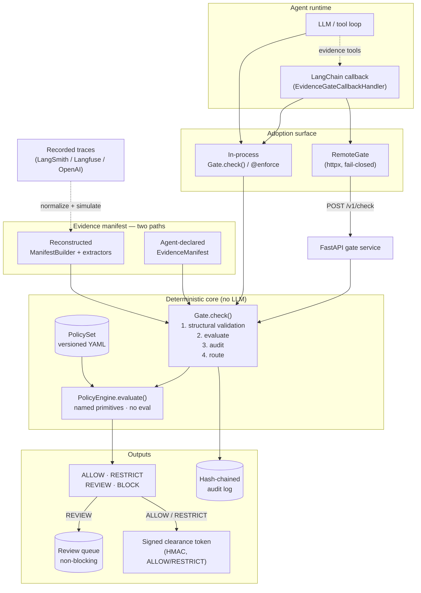

# Evidence Gate


> **Status: alpha (v0.3.0).** The core gate, engine, audit chain, cross-key
> `compare` rules, a real RESTRICT degradation path, and a live LLM agent work
> today — and v0.3 adds the **integration surface**: a remote HTTP gate service, a
> fail-closed client with name-pattern instrumentation, HMAC-signed clearance
> tokens, a Trace-to-Gate replay tool, and a LangChain callback adapter (see
> [Roadmap](#roadmap)). APIs are stabilizing but may still shift before v1.0.

A deterministic runtime enforcement layer that forces an agent to prove its
reasoning against ground-truth evidence **before** a state-changing action is
committed.

RBAC answers *"can this agent call this tool?"* It never answers *"is the
reasoning behind **this** call sound?"* An agent that hallucinates a request or
acts on stale data still emits a valid, authorized payload — a high-confidence
bad decision. The Evidence Gate closes that hole: it sits on the tool-call path,
demands an **Evidence Manifest** for every sensitive action, and evaluates that
evidence against explicit rules with **no LLM in the loop**.

See [`DESIGN.md`](./DESIGN.md) for the full architecture and
[`problem.md`](./problem.md) for the original requirements.

## Architecture

The gate is a **pure decision seam** — `evaluate(action, manifest, policy, now)` —
that everything else plugs into. The agent reaches it one of two ways (in-process,
or over HTTP through the fail-closed client), and the evidence manifest arrives one
of two ways (declared by the agent, or reconstructed from observed tool calls). All
paths converge on the *same* deterministic engine; no LLM ever runs inside it.



Two invariants hold across every path: the engine is a **pure function** of its
inputs (`now` is injected, never clock-read), and **nothing executes unrecorded** —
the audit record is appended before `check()` returns.

## Quick start

```bash
uv sync                         # install core deps into .venv
uv run examples/demo_agent.py   # marketing tripwire: the four failure modes
uv run examples/refund_agent.py # refund tripwire: cross-key compare + RESTRICT
uv run pytest                   # 89 tests: failure modes, determinism, audit, remote, adapters
```

The core gate depends only on `pydantic` + `pyyaml`; `openai`/`python-dotenv` come
along for the live-LLM example. The remote gate and framework adapters are **optional
extras**, so nothing that doesn't need FastAPI/httpx/LangChain pulls them in:

```bash
uv sync --extra service --extra client --extra langchain   # everything
```

| Extra | Adds | Enables |
|---|---|---|
| `service` | `fastapi`, `uvicorn` | `create_app()` — the HTTP gate service |
| `client`  | `httpx` | `RemoteGate` — the fail-closed remote client |
| `langchain` | `langchain-core` | `EvidenceGateCallbackHandler` |

## Running a real agent

`examples/llm_agent.py` puts an **actual LLM** behind the gate. The model is given
evidence-gathering tools plus a sensitive `send_marketing` tool it may only call
*with an Evidence Manifest it declares itself*; that manifest is routed through
`gate.check()`. The model never decides whether it is ready to act — the gate does.

```bash
uv run examples/llm_agent.py --mock   # scripted stand-in model — no API, no cost
uv run examples/llm_agent.py          # live, via OpenRouter z-ai/glm-4.7
```

The live path needs `OPENROUTER_API_KEY` in a gitignored `.env`. Point at any
OpenAI-compatible endpoint by overriding `LLM_BASE_URL`, `LLM_API_KEY`, `LLM_MODEL`.

Three contacts drive the three failure modes end-to-end — and the model *wants to
send in every case*, but the gate allows only the one with sound evidence:

```
contact 42  fresh opt-in      -> ALLOW   (executed)
contact 77  14-month-old opt-in-> REVIEW  (ticket queued, not executed)
contact 99  no record          -> BLOCK   (not executed)
```

## How it works

1. The agent proposes an action and **declares the evidence** behind it
   (`ProposedAction` + `EvidenceManifest`).
2. The gate runs **structural validation** — no manifest, no action.
3. The **policy engine** deterministically checks the evidence against a
   versioned YAML rule pack and returns one of `ALLOW / RESTRICT / REVIEW /
   BLOCK`.
4. On `REVIEW`, the full context is parked in a review queue **without breaking
   the agent loop**; on `BLOCK` the action is refused.
5. Every decision is written to a **hash-chained, tamper-evident audit log**.

The four evidence failure modes map to deliberate verdicts:

| Failure | Example | Default verdict |
|---|---|---|
| **Missing** | required fact never retrieved | `BLOCK` |
| **Stale** | opt-in older than the policy window | `REVIEW` |
| **Conflicting** | two sources disagree | `REVIEW` |
| **Unauthorized** | fact inferred, not observed | `BLOCK` |

## Usage

```python
from evidence_gate import Effect, Gate, PolicySet

gate = Gate(PolicySet.from_dir("policies"))

result = gate.check(action, manifest)   # deterministic verdict + audit record
if result.allowed:                       # ALLOW or RESTRICT
    tool.execute(action.payload)
```

Or wrap a tool function directly. On `RESTRICT` the tool still runs but is told
so via `effect=`, and degrades its own payload:

```python
@gate.enforce(action="billing.issue_refund")
def issue_refund(payload, effect):
    amount = payload["refund_amount"]
    if effect is Effect.RESTRICT:          # over the auto-approve ceiling
        amount = min(amount, 5000)         # execute a capped partial, not the full ask
    ...  # runs only on ALLOW/RESTRICT; raises ActionBlocked on BLOCK;
         # returns a pending GateResult on REVIEW
```

**Cross-key rules.** A `compare` block relates one evidence key to another key or
a literal threshold — the constraint the per-key requirements can't express:

```yaml
- id: refund_within_order_total
  compare: { left_key: "refund.amount", op: "<=", right_key: "order.total" }
  effect_on_fail: block            # can't refund more than was ever charged
```

**Trace-derived manifests.** Instead of the agent declaring its own manifest, the
gate can assemble one from the tool calls it actually made, via explicit
extractors (deterministic, no LLM):

```python
from evidence_gate import ManifestBuilder, ToolCall

builder = ManifestBuilder().register("get_optin", optin_extractor)
manifest = builder.build(recorded_tool_calls, compiled_at=now)
gate.check(action, manifest)       # evaluated identically to an agent-supplied one
```

## Remote gate (service + fail-closed client)

The same pure `check()` lifts behind FastAPI, so the engine and policies can live in
one place and agents call it over the wire. The client is **fail-closed**: an
unreachable gate never means "allow."

```python
# server — the gate service
from evidence_gate import Gate, PolicySet, Signer, create_app

app = create_app(Gate(PolicySet.from_dir("policies")), signer=Signer(b"secret-key"))
# uvicorn: `create_app` returns a FastAPI app with /v1/check, /v1/review, /v1/audit
```

```python
# client — wrap existing tools by name pattern, no per-call-site rewrite
from evidence_gate import RemoteGate

gate = RemoteGate("https://gate.internal")
gate.auto_instrument(tools, {"stripe_*": "billing.issue_refund"})

tools.stripe_refund(45, "late package")   # gated transparently; runs only on ALLOW/RESTRICT
#   BLOCK            -> raises ClearanceDenied(.reason, .request_id)
#   gate unreachable -> raises GateUnreachable (tool never runs)
```

On `ALLOW`/`RESTRICT` the service returns a short-lived **HMAC-signed clearance
token** (`Signer`/`Verifier`); the client verifies it on receipt. The same key
signs the audit chain — with `key=None` the chain hash is byte-identical to the
plain hash, so signing is a backwards-compatible drop-in.

## Trace-to-Gate (replay recorded traces)

Point the gate at the tool-call log an agent *already* produced and see what it
*would have decided* — the onboarding hook, before wiring anything live.

```python
from evidence_gate import TraceMapping, normalize, simulate

calls = normalize(trace_records, TraceMapping(tool="name", call_id="id",
                                              observed_at="ts", result="data.output")).calls
reports = simulate(calls, gate=gate, builder=builder,
                   action_mapping={"send_*": "marketing.send_sequence"}, now=now)
# -> [SimReport(request_id=..., effect=ALLOW/REVIEW/BLOCK, executed=..., reasons=[...])]
```

`normalize` maps arbitrary vendor exports (dotted field paths) into the `ToolCall`
shape; a record missing a required field is *skipped and surfaced*, never guessed.
`simulate` scopes evidence per turn and runs every sensitive call through the
untouched `gate.check()`. See `examples/trace_replay.py`.

## LangChain adapter

A callback handler that collects the evidence tools an agent runs and gates the
sensitive one before it executes — against an in-process `Gate` or the remote
client, via the same handler.

```python
from evidence_gate import Gate, ManifestBuilder, PolicySet
from evidence_gate.integrations.langchain import EvidenceGateCallbackHandler, LocalGatePort

port = LocalGatePort(Gate(PolicySet.from_dir("policies")), builder)   # or RemoteGatePort(RemoteGate(...))
handler = EvidenceGateCallbackHandler(port, action_mapping={"send_*": "marketing.send_sequence"})
agent.invoke(..., config={"callbacks": [handler]})   # BLOCK/REVIEW raise before the tool runs
```

See `examples/remote_agent.py`, `examples/trace_replay.py`, and
`examples/langchain_agent.py` for each path end-to-end.

## Layout

```
evidence_gate/
  schemas.py         # EvidenceItem, EvidenceManifest, ProposedAction, Decision
  policy.py          # typed rule models (incl. Comparison) + YAML loader
  engine.py          # evaluate() — pure, deterministic
  gate.py            # Gate.check() + @enforce decorator
  audit.py           # hash-chained append-only log
  review.py          # human-in-the-loop routing
  trace.py           # ManifestBuilder — derive a manifest from tool-call traces
  trace_adapters.py  # normalize() + simulate() — Trace-to-Gate replay
  signing.py         # HMAC Signer/Verifier — chain hash + clearance tokens
  service.py         # create_app() — FastAPI gate service        [extra: service]
  client.py          # RemoteGate — fail-closed client            [extra: client]
  integrations/
    langchain.py     # EvidenceGateCallbackHandler + GatePort seam [extra: langchain]
policies/            # marketing.yaml, refund.yaml
examples/            # demo_agent, refund_agent (RESTRICT), llm_agent (real LLM),
                     # remote_agent, trace_replay, langchain_agent
tests/               # golden + property tests (89)
```

## Roadmap

**Core — working since v0.2.0**

- [x] Typed schemas — `EvidenceItem` / `EvidenceManifest` / `ProposedAction` / `Decision`
- [x] Deterministic policy engine — pure `evaluate(action, manifest, policy, now)`
- [x] The seven requirement primitives + the four failure modes (`missing` / `stale`
      / `conflicting` / `unauthorized`)
- [x] `Gate.check()` + `@enforce` decorator; deny-by-default for ungoverned actions
- [x] Hash-chained, tamper-evident audit log; audited human-review resolution
- [x] In-memory review queue that never breaks the agent loop
- [x] Real LLM agent (`examples/llm_agent.py`) driving the gate end-to-end
- [x] **`RESTRICT` execution path** — large refund → capped partial (`examples/refund_agent.py`)
- [x] **Cross-key `compare` rules** — `refund.amount ≤ order.total` (DESIGN §12.4)
- [x] **Trace-derived manifests** — `ManifestBuilder` from recorded tool calls (DESIGN §12.1)

**Integration surface — new in v0.3.0**

- [x] **HTTP gate service** — `create_app()`, a FastAPI wrapper over `gate.check()`
      with both manifest paths (`service.py`, extra `service`)
- [x] **Fail-closed remote client** — `RemoteGate` with name-pattern
      `auto_instrument`, `ClearanceDenied` / `GateUnreachable` (`client.py`, extra `client`)
- [x] **Real-key signing** — HMAC `Signer`/`Verifier`; signed clearance tokens on
      ALLOW/RESTRICT; backwards-compatible audit-chain hash (`signing.py`)
- [x] **Trace-to-Gate replay** — generic `normalize()` + `simulate()` over the
      `ManifestBuilder` seam (`trace_adapters.py`)
- [x] **LangChain adapter** — `EvidenceGateCallbackHandler` over a local/remote
      `GatePort` seam (`integrations/langchain.py`, extra `langchain`)
- [x] 89 golden + property + integration tests

**Pending for the alpha line (next)**

- [ ] **Per-vendor trace normalizers** — LangSmith / Langfuse / OpenAI presets over
      the generic `TraceMapping` (a few lines each; the seam is done).
- [ ] **More framework adapters** — CrewAI, then LlamaIndex, reusing the `GatePort` seam.
- [ ] **OTel span events** — `evidence_gate.decision` / `.pending_review`,
      excluding raw args/prompt/model output (COMPARISON §6 #6).
- [ ] **Downstream token enforcement** — tokens are issued and verifiable today but
      not yet *required* by downstream tools; make verification a first-class gate.
- [ ] **Persistent audit + review backends** — the log/queue are in-memory; add a
      durable store for multi-process deployments.

**Deliberately deferred** (see [`DESIGN.md`](./DESIGN.md) §9)

- [ ] **Offline policy compiler** (SOP text → reviewed rule pack via an LLM) +
      approve/version workflow (COMPARISON §6 #7).
- [ ] **Trace ingestion → candidate rules** (distinct from replay: mining logs to
      *propose* policy, not just simulate it).
- [ ] **Asymmetric signing** — swap HMAC for public-key so verifiers need no shared
      secret; a drop-in over the current `Signer` (DESIGN §13.5).
- [ ] **RBAC/ABAC** — assumed upstream; the gate is orthogonal and additive.

## Release notes

### v0.3.0 alpha — the integration surface

v0.2.0 proved the thesis in-process; v0.3.0 makes it **adoptable** — the goal was
to close the gap between "a correct engine" and "something an agent builder can put
in front of a real tool without rewriting their stack," while keeping the engine
untouched. Everything below is plumbing over the pure `check()` seam:

- **Remote, fail-closed enforcement.** `create_app()` serves the gate over HTTP;
  `RemoteGate` calls it and refuses to execute when the gate is unreachable — an
  unavailable gate never silently allows.
- **Zero-touch instrumentation.** `RemoteGate.auto_instrument(tools, {"stripe_*":
  ...})` wraps existing tools by name pattern; call sites don't change.
- **Signed clearance.** HMAC `Signer`/`Verifier` issues short-lived tokens on
  ALLOW/RESTRICT and — with `key=None` — keeps the audit-chain hash byte-identical,
  so signing is a backwards-compatible drop-in.
- **Trace-to-Gate onboarding.** `normalize()` + `simulate()` replay a recorded
  trace through the gate to show what it *would have decided*, before wiring live.
- **Framework adapter.** `EvidenceGateCallbackHandler` gates a LangChain agent's
  sensitive tool call, working against the local `Gate` or the remote client via
  one `GatePort` seam.

Verified: 89 tests pass (45 original, unchanged); the audit chain is regression-clean
(unsigned == identical hashes); the base package imports without any extra; and all
three new examples run end-to-end (both manifest paths agree; fail-closed raises
without executing).

### v0.2.0 alpha — the core

The first version coherent enough to hand to someone else and have them gate a real
action end-to-end. The bar for "shippable" was: **every part of the thesis is
exercised by a runnable example and pinned by a test — no stubs on the critical
path.** What that means concretely:

- **A real agent can drive it.** `examples/llm_agent.py` puts a live LLM behind
  the gate; the model gathers evidence and *wants* to send in every case, and the
  gate — not the model — decides ALLOW / REVIEW / BLOCK.
- **All four verdicts execute, not just three.** `RESTRICT` is no longer a stub:
  `examples/refund_agent.py` degrades an over-ceiling refund to a capped partial
  and hard-BLOCKs a refund exceeding the order total.
- **Rules can span keys.** The `compare` primitive expresses
  `refund.amount ≤ order.total` and literal thresholds as named, `eval`-free
  operators.
- **Manifests can come from execution, not just self-report.** `ManifestBuilder`
  derives an `EvidenceManifest` from recorded tool-call traces via explicit
  extractors, converging on the exact schema the gate already evaluates.
- **Everything is recorded and reproducible.** Every `check()` appends a
  hash-chained audit record; the engine is a pure function of
  `(action, manifest, policy, now)`; 45 golden + property tests lock the four
  failure modes, aggregation, determinism, and chain integrity.

The v0.2.0 ship boundary called out four seams left open — the HTTP service,
real-key signing, the trace-log adapter, and the offline policy compiler. The first
three shipped in v0.3.0 (above); the offline compiler remains deferred (see
[Roadmap](#roadmap) and [`DESIGN.md`](./DESIGN.md) §9). APIs are stabilizing but may
still shift before v1.0.
