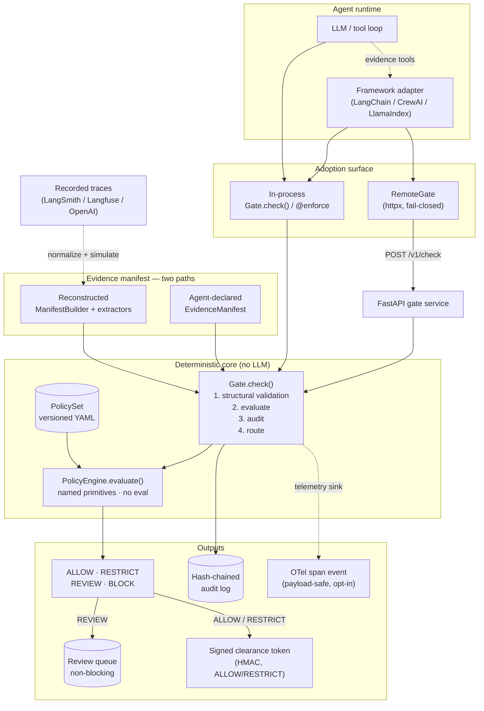

# Architecture

The gate is a **pure decision seam** — `evaluate(action, manifest, policy, now)` —
that everything else plugs into. The agent reaches it one of two ways (in-process,
or over HTTP through the fail-closed client), and the evidence manifest arrives one
of two ways (declared by the agent, or reconstructed from observed tool calls). All
paths converge on the *same* deterministic engine; no LLM ever runs inside it.



Two invariants hold across every path: the engine is a **pure function** of its
inputs (`now` is injected, never clock-read), and **nothing executes unrecorded** —
the audit record is appended before `check()` returns.

## How it works

1. The agent proposes an action and **declares the evidence** behind it
   (`ProposedAction` + `EvidenceManifest`).
2. The gate runs **structural validation** — no manifest, no action.
3. The **policy engine** deterministically checks the evidence against a
   versioned YAML rule pack and returns one of `ALLOW / RESTRICT / REVIEW / BLOCK`.
4. On `REVIEW`, the full context is parked in a review queue **without breaking
   the agent loop**; on `BLOCK` the action is refused.
5. Every decision is written to a **hash-chained, tamper-evident audit log**.

The four evidence failure modes map to deliberate verdicts:

| Failure | Example | Default verdict |
|---|---|---|
| **Missing** | required fact never retrieved | `BLOCK` |
| **Stale** | opt-in older than the policy window | `REVIEW` |
| **Conflicting** | two sources disagree | `REVIEW` |
| **Unauthorized** | fact inferred, not observed | `BLOCK` |

## Package layout

```
evidence_gate/
  schemas.py         # EvidenceItem, EvidenceManifest, ProposedAction, Decision
  policy.py          # typed rule models (incl. Comparison) + YAML loader
  engine.py          # evaluate() — pure, deterministic
  gate.py            # Gate.check() + @enforce decorator
  audit.py           # hash-chained append-only log
  review.py          # human-in-the-loop routing
  trace.py           # ManifestBuilder — derive a manifest from tool-call traces
  trace_adapters.py  # normalize() + simulate() + coverage() + vendor presets
  signing.py         # HMAC Signer/Verifier + require_clearance downstream guard
  cli.py             # evidence-gate: replay + audit verify   [console entrypoint]
  telemetry.py       # DecisionEvent + OTelSink — payload-safe span events [extra: otel]
  service.py         # create_app() — FastAPI gate service        [extra: service]
  client.py          # RemoteGate — fail-closed client            [extra: client]
  integrations/
    base.py          # GatePort / GateSession seam shared by all adapters
    langchain.py     # EvidenceGateCallbackHandler                 [extra: langchain]
    crewai.py        # gate_crew_tools() — gated BaseTool wrappers  [extra: crewai]
    llamaindex.py    # gate_llama_tools() — gated FunctionTool wrappers [extra: llamaindex]
policies/            # marketing.yaml, refund.yaml
examples/            # demo_agent, refund_agent (RESTRICT), llm_agent (real LLM),
                     # remote_agent, trace_replay, langchain_agent
tests/               # golden + property tests (127)
```

!!! note "Full design document"
    This page summarizes the architecture. The complete design — including the
    requirement primitives, the `compare` semantics, and the deferred-work
    rationale — lives in
    [`DESIGN.md`](https://github.com/paritoshmmmec/agents-law/blob/main/DESIGN.md).
